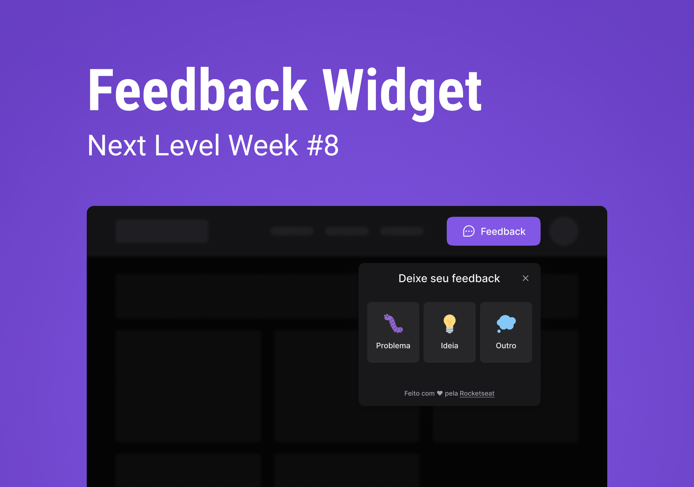

<h1 align="center">
  NLW Return Web
</h1>

<p align="center">
  <a href="#-projeto">Sobre o Projeto</a> •
  <a href="#-tecnologias">Tecnologias</a> •
  <a href="#-guia-de-instalação-e-execução">Guia de instalação</a> •
  <a href="#-license">License</a>
</p>

<p align="center">
  
</p>

## 👩‍💻 Projeto

[Feedback Widget](https://nlw-return-web-cyan.vercel.app/) é um projeto criado na [Rocketseat](https://rocketseat.com.br/) durante a NLW Return.

Neste projeto você pode enviar feedbacks de três diferentes tipos: problema, ideia ou bug. <br />
Onde você pode retirar um print da sua tela e enviar junto ao mesmo.

## 📚 Guia de instalação e execução

### Requisitos:

- [Git](https://git-scm.com/)
- [Node.js](https://nodejs.org/pt-br/)
- [Yarn](https://classic.yarnpkg.com/)

```bash
# Clone este projeto
$ git clone https://github.com/vagnereix/nlw-return-web.git

# Acesse
$ cd nlw-return-web

# Instale as dependências
$ yarn

# Faça uma cópia de '.env.example' para '.env'
# definindo com as SUAS variáveis de ambiente.

# Rode o projeto
yarn dev
```
Pronto! Você pode visualizar o ignews através do endereço http://localhost:3000

## 🚀 Tecnologias

- [Vite](https://vitejs.dev/)
- [ReactJS](https://reactjs.org/)
- [TypeScript](https://www.typescriptlang.org/)
- [TailwindCSS](https://tailwindcss.com/)

##

<p align="center">
Feito com 💜&nbsp;e ☕&nbsp;por <a href="https://github.com/vagnereix">Vagner Reis</a>
</p>
